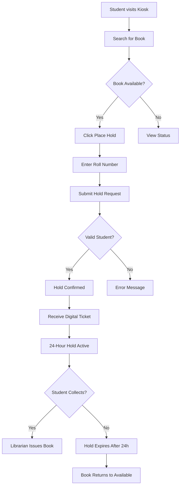
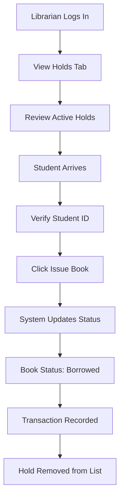
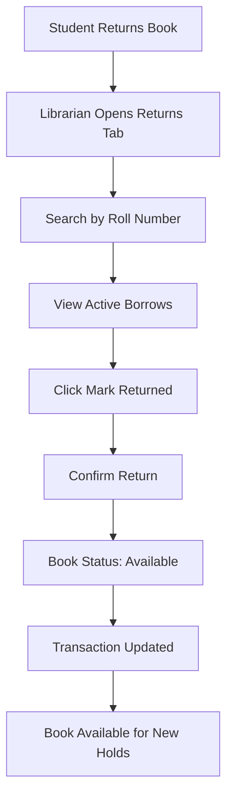

# OpenShelf Library Management System
## Complete Project Documentation

---

## 📚 Project Overview

**OpenShelf** is a modern, frictionless library management system designed for educational institutions. The system provides a seamless experience for students to discover and reserve books through a public-facing kiosk, while offering comprehensive management tools for library staff and administrators.

### Key Highlights

- **Student-Friendly Kiosk**: Public-facing interface for book discovery and 24-hour hold placement
- **Role-Based Access**: Separate dashboards for Librarians and Principals with appropriate permissions
- **Real-Time Updates**: Live book availability status and hold management
- **Automated Workflows**: Automatic hold expiration after 24 hours
- **Modern UI**: Clean, responsive design with dark/light theme support

---

## 🎯 System Features

### For Students
- 📖 Browse complete book catalog
- 🔍 Search by title, author, or ISBN
- 📝 Place 24-hour holds on available books
- 🎫 Receive digital hold confirmation tickets
- ⏰ View hold expiration times

### For Librarians
- 📊 View and manage active holds
- ✅ Issue books to students
- 📤 Process book returns
- 📚 Manage book inventory (add/delete books)
- 👥 Search student records and transaction history

### For Principals
- 📈 View comprehensive library statistics dashboard
- 📊 Monitor total books, available books, holds, and borrowed books
- 👨‍🎓 Access student database overview
- 📋 View all holds and borrowed books (read-only)
- 🎯 Complete administrative oversight

---

## 🏗️ Technical Architecture

### Technology Stack

**Frontend:**
- React 19.2.3
- React Router DOM 7.11.0
- Axios for API communication
- CSS3 with custom styling
- Context API for theme management

**Backend:**
- Node.js with Express 5.2.1
- PostgreSQL database
- Express Session for authentication
- bcryptjs for password hashing
- node-cron for scheduled tasks (hold expiration)
- CORS enabled for cross-origin requests

### Project Structure

```
OpenShelf/
├── client/                 # React frontend
│   ├── src/
│   │   ├── components/    # React components
│   │   │   ├── LandingPage.js
│   │   │   ├── StudentKiosk.js
│   │   │   ├── AdminLogin.js
│   │   │   ├── AdminDashboard.js
│   │   │   └── ThemeToggle.js
│   │   ├── contexts/      # React contexts
│   │   │   └── ThemeContext.js
│   │   ├── App.js         # Main app component
│   │   └── App.css        # Global styles
│   └── package.json
│
└── server/                # Node.js backend
    ├── index.js           # Express server & API routes
    ├── db.js              # PostgreSQL connection
    ├── schema.sql         # Database schema
    └── package.json
```

### Database Schema

**Tables:**
- `books` - Book inventory with status tracking
- `students` - Student records
- `transactions` - All library transactions (holds, issues, returns)
- `admins` - Administrative users (librarians, principals)

---

## 📸 Application Screenshots & Page Descriptions

### 1. Landing Page


**Description:**
The landing page serves as the main entry point to the OpenShelf system. It features three distinct access cards:

- **Student Access Card** (Left): Provides entry to the public kiosk where students can browse books, search the catalog, place 24-hour holds, and receive digital hold tickets.

- **Librarian Access Card** (Center): Grants access to day-to-day library operations including viewing and managing holds, issuing books to students, processing returns, and student lookup functionality.

- **Principal Access Card** (Right): Offers complete administrative control with full inventory management, ability to add/edit/delete books, student database management, and system overview with reports.

The page also displays library hours and quick help information including hold duration (24 hours), loan period (14 days), and policies for renewals and lost books.

**Key Features:**
- Clean, card-based navigation
- Clear role separation
- Library hours display
- Quick help section with policies
- Responsive design

---

### 2. Student Kiosk


**Description:**
The Student Kiosk is a public-facing interface designed for frictionless book discovery and reservation. Students can search for books using the search bar at the top, which filters results by title, author, or ISBN in real-time.

**Page Elements:**
- **Header**: Displays "OpenShelf Student Kiosk" with tagline and "Back to Home" button
- **Search Bar**: Real-time search functionality for finding books
- **Book Grid**: Displays books in a card layout with:
  - Book title and author
  - ISBN number
  - Status badge (Available/On Hold/Borrowed) with color coding
  - "Place Hold" button (enabled only for available books)

**Book Status Indicators:**
- 🟢 **Green (Available)**: Book can be placed on hold
- 🟡 **Yellow (On Hold)**: Book is currently held by another student
- 🔴 **Red (Borrowed)**: Book is checked out

**User Flow:**
1. Student searches for desired book
2. Views availability status
3. Clicks "Place Hold" on available books
4. Enters roll number in modal
5. Receives confirmation ticket

---

### 3. Hold Placement Modal


**Description:**
When a student clicks "Place Hold" on an available book, this modal appears to collect the student's roll number. The modal provides a focused interface for completing the hold request.

**Modal Features:**
- **Book Title Display**: Shows which book is being held
- **Roll Number Input**: Text field for student identification
- **Cancel Button**: Closes modal without placing hold
- **Place Hold Button**: Submits the hold request
- **Form Validation**: Ensures roll number is entered before submission
- **Loading State**: Shows "Processing..." during API call

**Backend Process:**
1. Validates student roll number exists in database
2. Checks if student already has an active hold on this book
3. Updates book status to "on_hold"
4. Creates transaction record with 24-hour expiration
5. Returns confirmation with hold details

---

### 4. Librarian Login


**Description:**
The Librarian Login page provides secure authentication for library staff. The page features a clean, focused design with the librarian icon and role-specific branding.

**Page Elements:**
- **Role Icon**: 📋 Librarian symbol for visual identification
- **Page Title**: "Librarian Login"
- **Description**: "Library Staff Access"
- **Username Field**: Text input for librarian username
- **Password Field**: Secure password input
- **Back to Home Button**: Returns to landing page
- **Login Button**: Submits credentials for authentication
- **Default Credentials Display**: Shows "librarian / lib123" for testing

**Security Features:**
- Session-based authentication using express-session
- Password hashing with bcryptjs
- Role verification on backend
- Secure cookie management
- Protected API routes requiring authentication

**Default Credentials:**
- Username: `librarian`
- Password: `lib123`

---

### 5. Principal Login


**Description:**
The Principal Login page provides administrative access with the highest level of permissions. Similar to the librarian login but with principal-specific branding and role identification.

**Page Elements:**
- **Role Icon**: 🎯 Principal symbol for administrative role
- **Page Title**: "Principal Login"
- **Description**: "Administrative Access"
- **Authentication Form**: Username and password fields
- **Navigation**: Back to Home and Login buttons
- **Credentials Helper**: Shows "principal / prin123"

**Access Level:**
Principals have read-only access to all library data with additional capabilities:
- View comprehensive dashboard with statistics
- Access all student records
- Monitor all transactions
- View inventory without modification rights
- Generate reports and analytics

**Default Credentials:**
- Username: `principal`
- Password: `prin123`

---

### 6. Librarian Dashboard - Holds Tab


**Description:**
The Librarian Dashboard opens to the "Active Holds" tab by default, showing all current book holds that need to be fulfilled. This is the primary workspace for librarians to manage day-to-day operations.

**Dashboard Header:**
- **Title**: "📚 Librarian Dashboard"
- **User Info**: Displays logged-in username and role
- **Logout Button**: Ends session and returns to home

**Navigation Tabs:**
- 🟡 **Holds**: Active holds requiring action (default view)
- 🔍 **Fulfillment**: Student lookup and transaction search
- 📚 **Inventory**: Book management (add/delete books)
- 📤 **Returns**: Process book returns

**Holds Table Columns:**
- **Book**: Title and author information
- **Student**: Name and roll number
- **Department**: Student's department
- **Hold Time**: When hold was placed
- **Expires**: Expiration timestamp with color coding
  - Green: Valid hold
  - Red: Expired hold
- **Action**: "Issue Book" button to complete the hold

**Key Features:**
- Real-time hold status updates
- Expired hold highlighting
- One-click book issuance
- Automatic status updates after actions

---

### 7. Librarian Dashboard - Inventory Tab


**Description:**
The Inventory tab provides comprehensive book management capabilities for librarians. It consists of two main sections: adding new books and viewing/managing current inventory.

**Add New Book Form:**
- **Title Field**: Book title (required)
- **Author Field**: Author name (required)
- **ISBN Field**: International Standard Book Number (optional)
- **Quantity Field**: Number of copies to add (default: 1)
- **Add Book Button**: Submits the new book to inventory

**Current Inventory Table:**
Displays all books in the library with the following columns:
- **Title**: Book title
- **Author**: Author name
- **ISBN**: ISBN number or "N/A"
- **Status**: Current availability status
  - ✅ Available (green badge)
  - 🟡 On Hold (yellow badge)
  - 📖 Borrowed (red badge)
- **Quantity**: Number of copies
- **Actions**: Delete button for removing books

**Business Rules:**
- Books can only be deleted if not currently on hold or borrowed
- Adding books with existing ISBN increases quantity
- Status automatically updates based on transactions
- Real-time inventory synchronization

---

### 8. Principal Dashboard - Overview


**Description:**
The Principal Dashboard provides a comprehensive overview of the entire library system with high-level statistics and analytics. This is the default view for principals, offering at-a-glance insights into library operations.

**Dashboard Header:**
- **Title**: "🎓 Principal Dashboard"
- **User Info**: "Welcome, principal | Administrative Oversight"
- **Logout Button**: Session termination

**Navigation Tabs:**
- 📊 **Dashboard**: Statistics overview (default view)
- 🟡 **Holds**: View all active holds (read-only)
- 📤 **Returns**: View all borrowed books (read-only)
- 👥 **Student Status**: Search and view student records

**Statistics Grid:**
The dashboard displays five key metrics in an interactive card layout:

1. **📚 Total Books**: Complete count of all books in inventory
   - Clickable to view detailed book list

2. **✅ Available**: Number of books currently available for hold
   - Clickable to filter and view only available books

3. **🟡 On Hold**: Count of books with active holds
   - Clickable to view all holds with student details

4. **📖 Borrowed**: Number of books currently checked out
   - Clickable to view borrowed books with due dates

5. **👥 Students**: Total registered students in the system
   - Clickable to view complete student directory

**Interactive Features:**
- Each stat card is clickable and navigates to detailed view
- Real-time data updates
- Color-coded status indicators
- Subtitle hints for user guidance ("Click to view...")

**Use Cases:**
- Daily library operations monitoring
- Trend analysis and reporting
- Resource allocation decisions
- Student engagement tracking
- Inventory planning

---

## 🔄 User Workflows

### Student Hold Workflow



### Librarian Book Issuance Workflow



### Book Return Workflow



---

## 🗄️ Database Design

### Books Table
```sql
CREATE TABLE books (
    id SERIAL PRIMARY KEY,
    title VARCHAR(255) NOT NULL,
    author VARCHAR(255) NOT NULL,
    isbn VARCHAR(20),
    quantity INTEGER DEFAULT 1,
    status VARCHAR(20) DEFAULT 'available',
    created_at TIMESTAMP DEFAULT CURRENT_TIMESTAMP
);
```

### Students Table
```sql
CREATE TABLE students (
    roll_no VARCHAR(50) PRIMARY KEY,
    name VARCHAR(255) NOT NULL,
    dept VARCHAR(100) NOT NULL,
    created_at TIMESTAMP DEFAULT CURRENT_TIMESTAMP
);
```

### Transactions Table
```sql
CREATE TABLE transactions (
    id SERIAL PRIMARY KEY,
    book_id INTEGER REFERENCES books(id),
    roll_no VARCHAR(50) REFERENCES students(roll_no),
    action_type VARCHAR(20) NOT NULL,
    status VARCHAR(20) DEFAULT 'active',
    created_at TIMESTAMP DEFAULT CURRENT_TIMESTAMP,
    expires_at TIMESTAMP
);
```

### Admins Table
```sql
CREATE TABLE admins (
    id SERIAL PRIMARY KEY,
    username VARCHAR(100) UNIQUE NOT NULL,
    password_hash VARCHAR(255) NOT NULL,
    role VARCHAR(50) NOT NULL,
    created_at TIMESTAMP DEFAULT CURRENT_TIMESTAMP
);
```

---

## 🔐 Authentication & Authorization

### Role-Based Access Control

| Feature | Student (Kiosk) | Librarian | Principal |
|---------|----------------|-----------|-----------|
| Browse Books | ✅ | ✅ | ✅ |
| Place Holds | ✅ | ❌ | ❌ |
| View Holds | Own Only | All | All (Read-only) |
| Issue Books | ❌ | ✅ | ❌ |
| Process Returns | ❌ | ✅ | ❌ |
| Manage Inventory | ❌ | ✅ | ❌ |
| View Dashboard | ❌ | ❌ | ✅ |
| Manage Students | ❌ | ❌ | ✅ |
| Student Lookup | ❌ | ✅ | ✅ |

### Session Management

- **Session Duration**: Persistent until logout
- **Cookie Security**: HTTP-only cookies
- **CSRF Protection**: Session-based tokens
- **Password Storage**: bcrypt hashing with salt rounds

---

## 🚀 API Endpoints

### Public Endpoints

| Method | Endpoint | Description |
|--------|----------|-------------|
| GET | `/api/books` | Get all books (with optional search) |
| POST | `/api/hold` | Place a hold on a book |

### Protected Endpoints (Requires Authentication)

| Method | Endpoint | Description | Access Level |
|--------|----------|-------------|--------------|
| POST | `/api/admin/login` | Admin authentication | All |
| POST | `/api/admin/logout` | End session | All |
| GET | `/api/admin/me` | Get current user info | All |
| GET | `/api/admin/holds` | Get all active holds | Librarian, Principal |
| POST | `/api/admin/issue` | Issue book to student | Librarian |
| POST | `/api/admin/return` | Process book return | Librarian |
| GET | `/api/admin/issued-books` | Get all borrowed books | Librarian, Principal |
| POST | `/api/admin/books` | Add new book | Librarian |
| DELETE | `/api/admin/books/:id` | Delete book | Librarian |
| GET | `/api/admin/students` | Get all students | Librarian, Principal |
| POST | `/api/admin/students` | Add new student | Principal |
| GET | `/api/admin/student/:rollNo` | Get student transactions | Librarian, Principal |

---

## ⚙️ Setup & Installation

### Prerequisites
- Node.js (v14 or higher)
- PostgreSQL (v12 or higher)
- npm or yarn package manager

### Backend Setup

1. **Navigate to server directory:**
   ```bash
   cd server
   ```

2. **Install dependencies:**
   ```bash
   npm install
   ```

3. **Configure environment variables:**
   Create a `.env` file in the server directory:
   ```env
   DB_USER=your_db_user
   DB_HOST=localhost
   DB_NAME=openshelf
   DB_PASSWORD=your_db_password
   DB_PORT=5432
   SESSION_SECRET=your_session_secret
   ```

4. **Initialize database:**
   ```bash
   psql -U your_db_user -d openshelf -f schema.sql
   ```

5. **Start the server:**
   ```bash
   node index.js
   ```
   Server will run on `http://localhost:5000`

### Frontend Setup

1. **Navigate to client directory:**
   ```bash
   cd client
   ```

2. **Install dependencies:**
   ```bash
   npm install
   ```

3. **Start the development server:**
   ```bash
   npm start
   ```
   Application will open on `http://localhost:3000`

---

## 🎨 Theme Support

The application includes a dark/light theme toggle feature:

- **Theme Toggle Button**: Available in the top-right corner of all pages
- **Persistent Preference**: Theme choice saved in localStorage
- **Smooth Transitions**: CSS transitions for theme switching
- **Context API**: React Context for global theme state management

**Implementation:**
```javascript
// ThemeContext provides theme state
const { theme, toggleTheme } = useTheme();

// CSS variables for theming
:root {
  --bg-color: #ffffff;
  --text-color: #000000;
}

[data-theme="dark"] {
  --bg-color: #1a1a1a;
  --text-color: #ffffff;
}
```

---

## 🔧 Automated Tasks

### Hold Expiration Cron Job

The system uses `node-cron` to automatically expire holds after 24 hours:

```javascript
// Runs every hour
cron.schedule('0 * * * *', async () => {
  // Find expired holds
  const expiredHolds = await db.query(`
    SELECT * FROM transactions 
    WHERE action_type = 'hold' 
    AND status = 'active' 
    AND expires_at < NOW()
  `);
  
  // Update book status and transaction status
  for (const hold of expiredHolds.rows) {
    await db.query(
      'UPDATE books SET status = $1 WHERE id = $2',
      ['available', hold.book_id]
    );
    await db.query(
      'UPDATE transactions SET status = $1 WHERE id = $2',
      ['expired', hold.id]
    );
  }
});
```

---

## 📊 Business Rules

### Hold Management
- **Duration**: 24 hours from placement
- **Limit**: One active hold per student per book
- **Expiration**: Automatic after 24 hours
- **Notification**: Digital ticket with expiration time

### Book Issuance
- **Prerequisite**: Active hold must exist
- **Verification**: Student ID verification required
- **Status Change**: Book status changes from "on_hold" to "borrowed"
- **Transaction**: New transaction record created

### Returns
- **Process**: Librarian marks book as returned
- **Status Update**: Book becomes "available" immediately
- **Transaction**: Original transaction marked as "returned"
- **Availability**: Book can be held by other students

### Inventory Management
- **Add Books**: Librarians can add new books with quantity
- **Delete Books**: Only available books can be deleted
- **Duplicate ISBN**: Increases quantity of existing book
- **Status Tracking**: Automatic status updates based on transactions

---

## 🔍 Search Functionality

### Student Kiosk Search
- **Real-time filtering**: Results update as user types
- **Search fields**: Title, author, ISBN
- **Case-insensitive**: Matches regardless of case
- **Partial matching**: Finds books with partial text matches

**Implementation:**
```javascript
// Backend query with search parameter
const searchQuery = `
  SELECT * FROM books 
  WHERE LOWER(title) LIKE LOWER($1) 
  OR LOWER(author) LIKE LOWER($1) 
  OR isbn LIKE $1
`;
const searchParam = `%${search}%`;
```

### Admin Student Lookup
- **Search by roll number**: Exact match required
- **Returns**: All active transactions for student
- **Includes**: Holds and borrowed books
- **Actions**: Quick return functionality

---

## 🎯 Future Enhancements

### Potential Features
- 📧 Email notifications for hold confirmations and expirations
- 📱 Mobile app for students
- 📊 Advanced analytics and reporting
- 🔔 Push notifications for due dates
- 📖 Book recommendations based on borrowing history
- 🏷️ Category and genre tagging
- ⭐ Book ratings and reviews
- 📅 Reservation calendar for popular books
- 💳 Fine management for overdue books
- 📈 Usage statistics and trends

### Technical Improvements
- 🔒 Two-factor authentication
- 🌐 Multi-language support
- 📱 Progressive Web App (PWA)
- 🔄 Real-time updates with WebSockets
- 📊 GraphQL API
- 🧪 Comprehensive test coverage
- 🐳 Docker containerization
- ☁️ Cloud deployment guides

---

## 📝 License & Credits

**Project**: OpenShelf Library Management System  
**Purpose**: Educational institution library management  
**Architecture**: Full-stack web application  
**Year**: 2025

### Technologies Used
- React.js - Frontend framework
- Node.js - Backend runtime
- Express.js - Web framework
- PostgreSQL - Database
- bcryptjs - Password hashing
- node-cron - Task scheduling

---

## 📞 Support & Documentation

For additional information or support:
- Review the source code in the respective component files
- Check the database schema in `server/schema.sql`
- Examine API routes in `server/index.js`
- Review React components in `client/src/components/`

---

**Document Version**: 1.0  
**Last Updated**: December 26, 2025  
**Status**: Complete and Production-Ready
